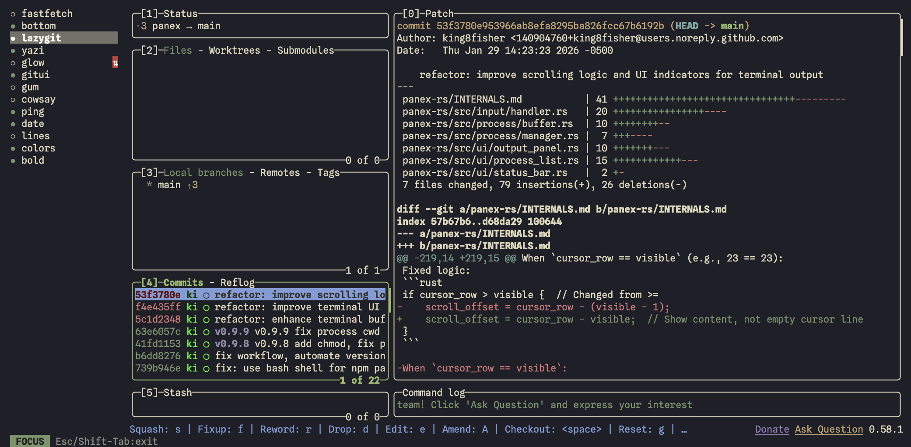

# panex

A terminal UI for running multiple processes in parallel. Like Turborepo's TUI, without the monorepo.



## Features

- **Split-pane TUI** - See all your processes at once
- **Full PTY support** - QR codes, colors, interactive prompts work
- **Scroll pinning** - Freeze output to inspect, toggle with `g`
- **Zero config** - Just pass commands as arguments
- **Cross-platform** - macOS, Linux, Windows
- **Native binary** - Fast startup, no runtime dependencies

## Installation

```bash
# Run directly with npx or bunx
npx panex "npm run api" "npm run web"
bunx panex "bun run api" "bun run web"

# Or install globally
npm install -g panex
```

## Usage

### Quick Start

```bash
# Run multiple commands
panex "npm run api" "npm run web" "npm run mobile"

# With custom names
panex -n api,web,mobile "npm run api" "npm run web" "npm run mobile"
```

### Keyboard Shortcuts

| Key          | Action                           |
| ------------ | -------------------------------- |
| `↑/↓`        | Navigate process list            |
| `Enter/Tab`  | Focus process (interactive mode) |
| `Esc`        | Exit focus mode                  |
| `r`          | Restart selected process         |
| `x`          | Kill selected process            |
| `A`          | Restart all processes            |
| `g`          | Toggle pin (freeze/follow output)|
| `t`          | Jump to top                      |
| `b`          | Jump to bottom                   |
| `PgUp/PgDn`  | Scroll output                    |
| `?`          | Show help                        |
| `q`          | Quit panex                       |

## Why panex?

| Feature                | panex | concurrently | mprocs | turbo |
| ---------------------- | ----- | ------------ | ------ | ----- |
| Split-pane TUI         | ✅     | ❌            | ✅      | ✅     |
| PTY support (QR codes) | ✅     | ❌            | ✅      | ✅     |
| Zero config            | ✅     | ✅            | ❌      | ❌     |
| npm install            | ✅     | ✅            | ❌      | ✅     |
| No monorepo required   | ✅     | ✅            | ✅      | ❌     |

## Development

```bash
# Clone
git clone https://github.com/king8fisher/panex
cd panex

# Build (requires Rust)
cargo build --release -p panex

# Run locally
./panex-rs/target/release/panex "echo hello" "sleep 2 && echo world"

# Or with mise
mise run build
mise run dev
```

### Releasing

```bash
# Create and push a release tag (triggers CI build + npm publish)
mise run release 1.0.0
```

## Tech Stack

- Rust
- ratatui (TUI framework)
- portable-pty (PTY support)
- clap (CLI parsing)

## License

MIT Anton Veretennikov (king8fisher)
