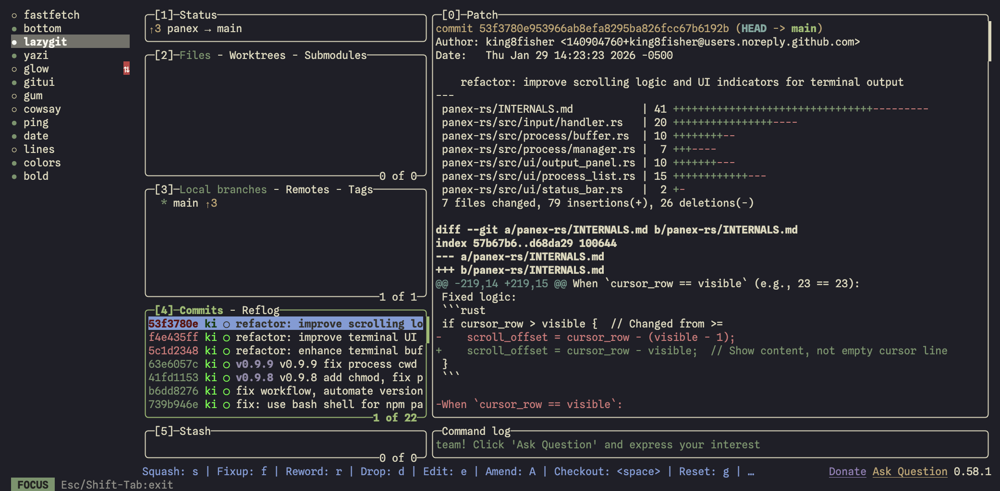

[](https://www.npmjs.com/package/panex)

# panex

A terminal UI for running multiple processes in parallel. Like Turborepo's TUI, without the monorepo.



## Features

- **Split-pane TUI** - See all your processes at once
- **Full PTY support** - QR codes, colors, interactive prompts work
- **Scroll pinning** - Freeze output to inspect, toggle with `g`
- **Zero config** - Just pass commands as arguments
- **Cross-platform** - macOS, Linux, Windows
- **Native binary** - Fast startup, no runtime dependencies
- **Wrapped lines** - Optional line wrapping per pane (`:w` label suffix)
- **Interactive mode** - Focus a pane for full interactivity (with Mouse support)
- **Mouse forwarding** - Mouse clicks/drags/scrolls forwarded to child TUI apps in focus mode
- **Nestable** - Run panex inside panex, or any TUI app, with correct rendering

## Installation

```bash
# Run directly with npx or bunx
npx panex "npm run api" "npm run web"
bunx panex "bun run api" "bun run web"

# Or install globally
npm install -g panex
```

## Usage

### Quick Start

```bash
# Run multiple commands
panex "npm run api" "npm run web" "npm run mobile"

# With custom names
panex -n api,web,mobile "npm run api" "npm run web" "npm run mobile"

# Full key passthrough for TUI apps (append ! to name)
# Esc and Shift-Tab forwarded to process, click left panel to exit
panex "tui" "npm run dev" -n "tui!,server"

# Enable line wrapping (append :w to name)
panex "npm run build" -n "build:w"

# Combine suffixes (either order works)
panex "helix" "npm run build" -n "helix!:w,build:w"

# Custom shutdown timeout (default: 500ms)
panex -t 1000 "npm run dev"  # 1 second graceful shutdown

# Disable auto-copy on mouse select (require y/Enter/Ctrl-C to copy)
panex --no-auto-copy "npm run api" "npm run web"
```

### Keyboard Shortcuts

| Key         | Action                            |
| ----------- | --------------------------------- |
| `↑/↓`       | Navigate process list             |
| `Enter/Tab` | Focus process (interactive mode)  |
| `Esc`       | Exit focus mode                   |
| `Shift-Tab` | Exit focus mode (unless disabled) |
| `r`         | Restart selected process          |
| `x`         | Kill selected process             |
| `A`         | Restart all processes             |
| `w`         | Toggle line wrapping              |
| `g`         | Toggle pin (freeze/follow output) |
| `t`         | Jump to top                       |
| `b`         | Jump to bottom                    |
| `PgUp/PgDn` | Scroll output                     |
| `?`         | Show help                         |
| `v`         | Visual select (char-wise)         |
| `V`         | Visual select (line-wise)         |
| `y/Enter`   | Copy selection to clipboard       |
| `q`         | Quit panex                        |

### Mouse

**Browse mode:**

| Click        | Action                  |
| ------------ | ----------------------- |
| Left panel   | Exit focus, select item |
| Right panel  | Enter focus mode        |
| Drag         | Select text (auto-copy) |
| Double-click | Select word             |
| Triple-click | Select line             |
| Status bar   | Exit focus mode         |
| Scroll wheel | Scroll output           |

**Focus mode:** All mouse events (click, drag, scroll) on the output panel are forwarded to the child process as SGR escape sequences. Click the left panel or status bar to exit focus.

## Why panex?

| Feature                | panex | concurrently | mprocs | turbo |
| ---------------------- | ----- | ------------ | ------ | ----- |
| Split-pane TUI         | ✅     | ❌            | ✅      | ✅     |
| PTY support (QR codes) | ✅     | ❌            | ✅      | ✅     |
| Zero config            | ✅     | ✅            | ❌      | ❌     |
| npm install            | ✅     | ✅            | ❌      | ✅     |
| No monorepo required   | ✅     | ✅            | ✅      | ❌     |

## Development

```bash
# Clone
git clone https://github.com/king8fisher/panex
cd panex

# Build (requires Rust)
cargo build --release -p panex

# Run locally
./panex-rs/target/release/panex "echo hello" "sleep 2 && echo world"

# Or with mise
mise run build
mise run dev
```

### Releasing

```bash
# Create and push a release tag (triggers CI build + npm publish)
mise run release 1.0.0
```

## Tech Stack

- Rust
- ratatui (TUI framework)
- portable-pty (PTY support)
- clap (CLI parsing)

## License

MIT Anton Veretennikov (king8fisher)
